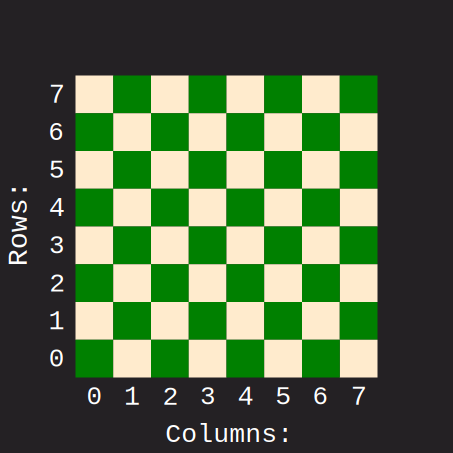

# web-chess

## The chess game

To begin with the main plan is to implement a functioning chess game, which then will be extended to support multiplayer.

### Implementation

#### Chess board

The board will be represented as 2D array, where the coordinate `row: 0` and `column: 0` represents the bottom left corner of the board. Moving horizontally right increases the `column` index and moving vertically up increases the `row` index.
Resulting in the familiar coordinate system we love. The range of the `column` and `row` axis will be `0-7` which
will allow us to represent the board as the 8 by 8 square it is.

The `Board` type is defined as 2D array of `Squares` which can either contain `null` or a `ChessPiece`

> **Note**: in cases where the coordinate is represented in the format `x,y` then interpret `column: x` and `row: y`

#### Flipping the board

In order to achieve the flipping of the board, which is a necessary feature for local games. I aimed for the simplistic method of just adding conditions for controlling the sequence in which the squares of the board get rendered. This way i can leave the actual matrix stored in the chess game object alone in the background, maintaining its integrity and simply clearing the screen and rendering the board in an opposite sequence.

#### Getting the moves

The idea behind the retrieval/calculation of the valid moves i've chosen a method of filtering. Firstly the main function to get all pieces possible moves without regard for check or any other constraints, these moves would simply be all moves a piece could either go to or capture.

I've further chosen to categorize Rook, Bishop and Queen as 'sliding pieces' meaning they have pretty much the same logic except for different directions they're able to move, effectively cutting down the amount of repeated code.  

The rest of the pieces need their own specific way of retrieving moves

But after these move functions have been defined for each piece, and also with the inclusion of the `ignore_king: boolean` flag i will be able to filer out valid moves later on such that i can account for checks and situations where pieces need to make forced moves or are pinned in place or have limited moves they can make without causing check on their own king.

#### Board Squares

The board squares represent the state of a given square within a board. It's defined as a type that either contains a `ChessPiece` object or is `null`.

#### Pieces

All chess pieces are their own class that inherits from the abstract class `ChessPiece`.
